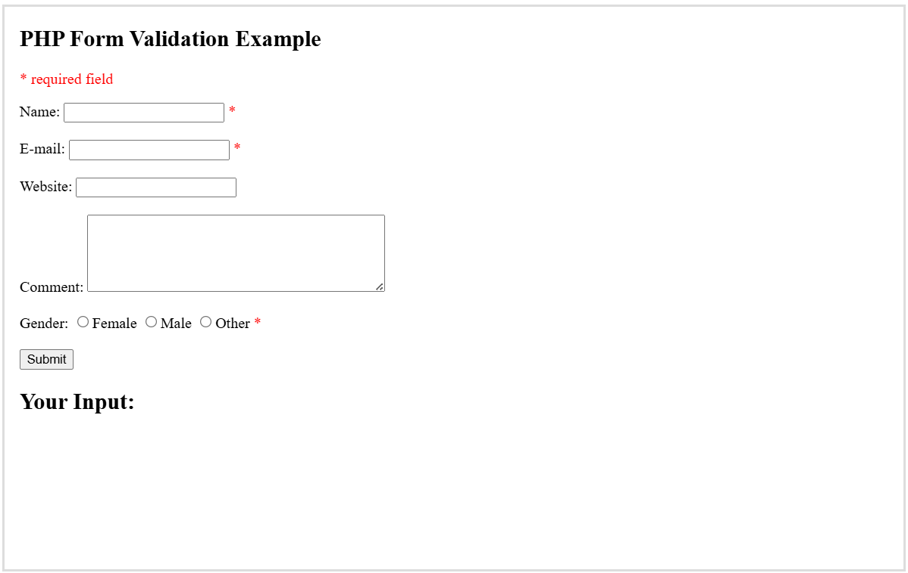

<H4>PHP Form Validation<H4> 

Think SECURITY when processing PHP forms!

These pages will show how to process PHP forms with security in mind. Proper validation of form data is important to protect your form from hackers and spammers! 

 

<table>
  <tr>
    <th>Field</th>
    <th>Validation Rules</th>
  </tr>

  <tr>
    <td>Name</td>
    <td>Required. + Must only contain letters and whitespace</td>
  </tr>

  <tr>
    <td>E-mail</td>
    <td>Required. + Must contain a valid email address (with @ and .)</td>
  </tr>

  <tr>
  <td>Website</td>
  <td>Optional. If present, it must contain a valid URL</td>
  </tr>

  <tr>
    <td>Comment</td>
    <td>Optional. Multi-line input field (textarea)</td>
  </tr>

  <tr>
  <td>Gender</td>
  <td>Required. Must select one</td>
  </tr>
</table>

**Text Fields 
The name, email, and website fields are text input elements, and the comment field is a textarea.

The HTML code looks like this:
--> <a href="">Text Filds</a>

***Radio Buttons 
The gender fields are radio buttons and the HTML code looks like this:
--> <a href="">Radio Buttons</a>

<pre>What is the $_SERVER["PHP_SELF"] variable?

The $_SERVER["PHP_SELF"] is a super global variable that returns the filename of the currently executing script.
</pre>

So, the $_SERVER["PHP_SELF"] sends the submitted form data to the page itself, instead of jumping to a different page. This way, the user will get error messages on the same page as the form.

<pre>What is the htmlspecialchars() function?

The htmlspecialchars() function converts special characters into HTML entities. This means that it will replace HTML characters like < and > with &lt; and &gt;. This prevents attackers from exploiting the code by injecting HTML or Javascript code (Cross-site Scripting attacks) in forms.
</pre>

***Warning!
The $_SERVER["PHP_SELF"] variable can be used by hackers! 

If PHP_SELF is used in your page then a user can enter a slash / and then some Cross Site Scripting (XSS) commands to execute.

