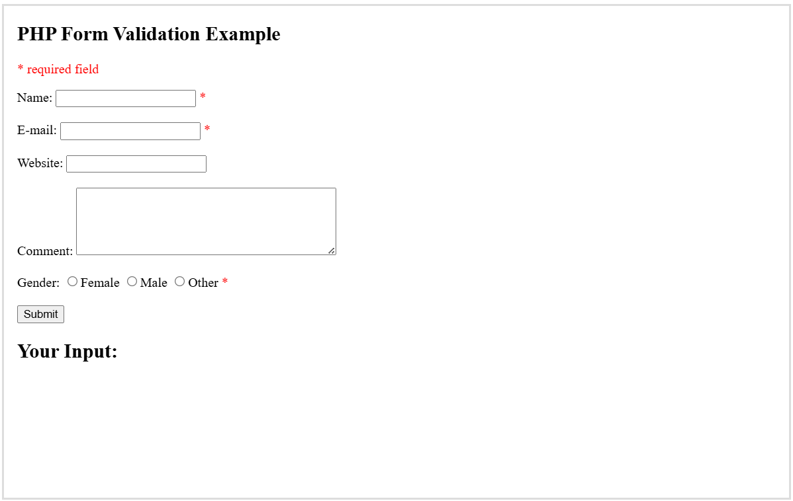

<H4>PHP Form Validation<H4> 

Think SECURITY when processing PHP forms!

These pages will show how to process PHP forms with security in mind. Proper validation of form data is important to protect your form from hackers and spammers! 

 

<table>
  <tr>
    <th>Field</th>
    <th>Validation Rules</th>
  </tr>

  <tr>
    <td>Name</td>
    <td>Required. + Must only contain letters and whitespace</td>
  </tr>

  <tr>
    <td>E-mail</td>
    <td>Required. + Must contain a valid email address (with @ and .)</td>
  </tr>

  <tr>
  <td>Website</td>
  <td>Optional. If present, it must contain a valid URL</td>
  </tr>

  <tr>
    <td>Comment</td>
    <td>Optional. Multi-line input field (textarea)</td>
  </tr>

  <tr>
  <td>Gender</td>
  <td>Required. Must select one</td>
  </tr>
</table>

<h3>Define an HTML Table</h3>

A table in HTML consists of table cells inside rows and columns.

<h3>Example</h3>

A simple HTML table:

<pre>
  <table>
    <tr>
      <th>Company</th>
      <th>Contact</th>
      <th>Country</th>
    </tr>
    <tr>
      <td>Alfreds Futterkiste</td>
      <td>Maria Anders</td>
      <td>Germany</td>
    </tr>
    <tr>
      <td>Centro comercial Moctezuma</td>
      <td>Francisco Chang</td>
      <td>Mexico</td>
    </tr>
  </table>
</pre>
/*       

<tr>
    <td>Name</td>
    <td>Required. + Must only contain letters and whitespace</td>
  </tr>

tje dp  */

